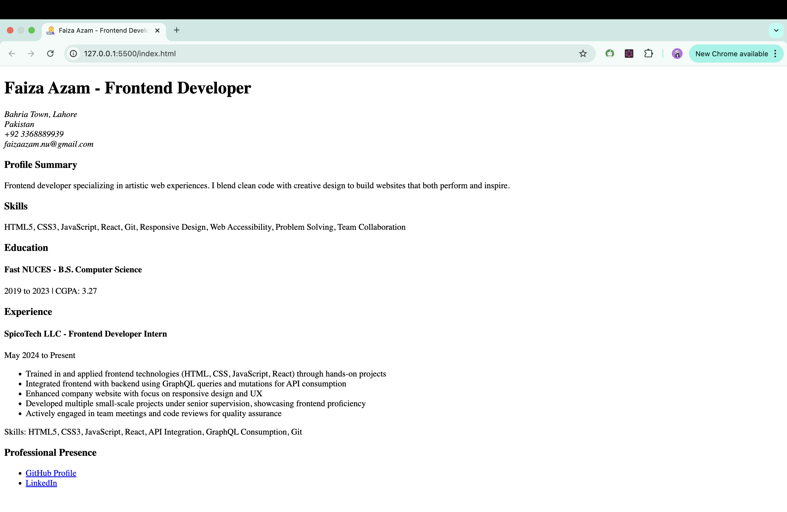

# Single Page CV - HTML

A minimalist CV webpage built with semantic HTML. Solution for the [Single Page CV Project](https://roadmap.sh/projects/single-page-cv) from roadmap.sh.

### CV - Preview

## Live Demo

View the CV at: [https://faizaazam-1.github.io/Single-Page-CV-HTML/](https://faizaazam-1.github.io/Single-Page-CV-HTML/)

## Features

- Pure HTML implementation
- SEO-optimized meta tags
- Open Graph tags for social sharing
- Semantic HTML5 structure
- Custom favicon

## Project Requirements

This project is created following the requirements from:
[https://roadmap.sh/projects/single-page-cv](https://roadmap.sh/projects/single-page-cv)

## Author

Faiza Azam
- GitHub: [@faizaazam-1](https://github.com/faizaazam-1)
